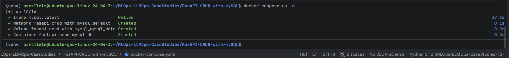
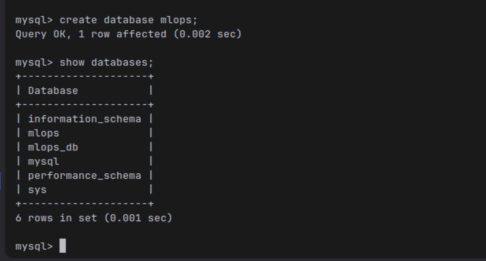
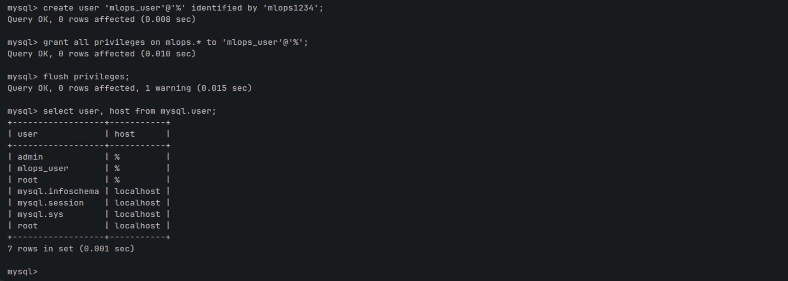

## MySQL Docker Setup

### 1. Start MySQL Container

Use the following command to start the MySQL container using the provided `docker-compose.yaml` file:

```bash
docker compose up -d
```



### 2. Connect to the MySQL Container

```bash
docker exec -it fastapi_crud_mysql mysql -u root -p
```


### 3. Create the mlops Database

```bash
CREATE DATABASE mlops;
```


### 4. Create the mlops_user

```bash
CREATE USER 'mlops_user'@'%' IDENTIFIED BY 'your_password';
```

### 5. Grant Privileges to mlops_user

```bash
GRANT ALL PRIVILEGES ON mlops.* TO 'mlops_user'@'%';

FLUSH PRIVILEGES;
```


### 6. Verify Databases and Users
#### Show Database List
```bash
SHOW DATABASES;
```
#### Show Database List
```bash
SELECT user, host FROM mysql.user;
```

## Dataset

The dataset was downloaded into the `data/raw` directory using:

```bash
wget https://raw.githubusercontent.com/erkansirin78/datasets/master/retail_db/customers.csv
```

This project is part of the `MLOps-LLMOps-CaseStudies` monorepo.  
DVC was initialized with `--subdir` because the project lives inside a parent Git repository.

```bash
dvc init --subdir
```
### Before running the FastAPI application, make sure the MySQL container is running:

```bash
docker compose up -d